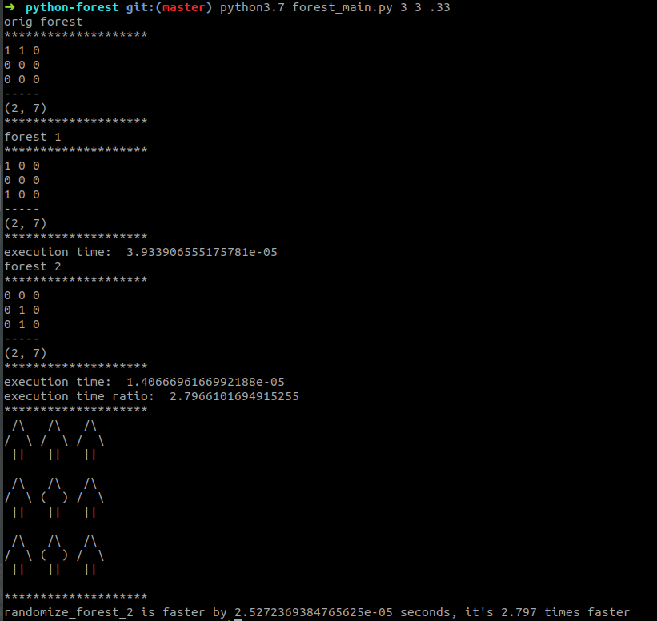

# Examples



## Usage

```
python3 forest_main.py

python3 forest_main.py <rows> <columns> <tree type ratio>
```

A forest is a 2D list

- rows - number of rows in the forest
- columns - number of columns in the forest
- tree type ratio - proportion of leafy trees to coniferous trees
